# EQ Presets Guide: Understanding Your Audio

Welcome to the Equaliser presets guide. This document explains each factory preset in detail, helping you understand when and how to use them for the best audio experience.

Whether you're a casual user looking for the right sound or someone who wants to understand the technical reasoning behind each curve, this guide has you covered.

---

## Quick Reference

| Preset | Bands | Purpose | Best For | Avoid For |
|--------|-------|---------|----------|-----------|
| **Flat** | 10 | Neutral baseline | Reference, testing | N/A |
| **Bass Boost** | 12 | Deep, punchy bass | Hip-hop, EDM, action movies | Podcasts, audiobooks |
| **Treble Boost** | 10 | Brightness & clarity | Classical, acoustic, podcasts | Already bright content |
| **Vocal Presence** | 14 | Clear, intelligible vocals | Podcasts, voice calls, audiobooks | Bass-heavy music |
| **Loudness** | 10 | Low-volume compensation | Night listening, quiet environments | Normal/loud volumes |
| **Acoustic** | 11 | Warm, natural tone | Acoustic music, singer-songwriter | Electronic, rock |
| **Rock** | 12 | Aggressive, scooped mids | Rock, metal, alternative | Jazz, classical |
| **Electronic** | 13 | Tight bass, bright highs | EDM, techno, house | Acoustic, jazz |
| **Jazz** | 10 | Warm, smooth sound | Jazz, blues, soul | Electronic, metal |
| **Podcast** | 12 | Optimized for speech | Podcasts, audiobooks, voice | Music |
| **Classical** | 9 | Neutral, refined | Orchestral, chamber music | Bass-heavy genres |

---

## EQ Fundamentals

### What is EQ?

EQ (equalization) lets you adjust the volume of different frequency ranges in your audio. Think of it like a sophisticated tone control that can target specific parts of the sound spectrum.

### Filter Types

**Parametric EQ** - The most versatile type. You choose:
- **Frequency**: Which part of the spectrum to adjust
- **Gain**: How much to boost or cut
- **Bandwidth**: How wide or narrow the adjustment is

**Shelf EQ** - Adjusts all frequencies above or below a point:
- **Low Shelf**: Boosts or cuts bass frequencies gradually
- **High Shelf**: Boosts or cuts treble frequencies gradually

**High-Pass Filter** - Removes frequencies below a cutoff point. Used to clean up rumble and unwanted low-frequency noise.

<details>
<summary>🔧 Technical Details: Filter Types (click to expand)</summary>

**Parametric EQ** provides surgical control with three parameters:
- **Frequency (Hz)**: The center point of the adjustment
- **Gain (dB)**: The amount of boost (+) or cut (-)
- **Bandwidth (octaves)**: The range of frequencies affected. Also expressed as Q factor, where Q = center frequency / bandwidth. Higher Q = narrower bandwidth.

**Shelf EQ** creates gradual transitions:
- **Low Shelf**: All frequencies below the shelf frequency are boosted/cut by the specified amount, with a gradual transition around the shelf frequency
- **High Shelf**: All frequencies above the shelf frequency are boosted/cut, with gradual transition
- The transition slope is typically 6-12 dB per octave

**High-Pass Filter** (also called low-cut):
- Attenuates frequencies below the cutoff point
- Slope typically 12-24 dB per octave
- Used to remove rumble, handling noise, and unnecessary low-frequency content

</details>

### Bandwidth Explained

**Simple explanation**: Bandwidth controls how "focused" or "wide" an EQ adjustment is.

- **Narrow bandwidth** (0.7-0.9): Precise, surgical adjustment. Affects only the target frequency and its immediate neighbors.
- **Medium bandwidth** (1.0): Balanced adjustment. Affects a moderate range around the target.
- **Wide bandwidth** (1.1-1.5): Musical, smooth adjustment. Affects a broad range, creating natural transitions.

<details>
<summary>🔧 Technical Details: Bandwidth & Q Factor (click to expand)</summary>

**Bandwidth** is measured in octaves. One octave = doubling of frequency (e.g., 100 Hz to 200 Hz is one octave).

**Q Factor** (Quality Factor) is the inverse relationship:
- Q = Center Frequency / Bandwidth (in Hz)
- Higher Q = Narrower bandwidth
- Lower Q = Wider bandwidth

**Conversion examples:**
- Bandwidth 0.7 octaves ≈ Q 2.0 (very narrow, surgical)
- Bandwidth 1.0 octaves ≈ Q 1.4 (medium, balanced)
- Bandwidth 1.4 octaves ≈ Q 1.0 (wide, musical)

**When to use narrow bandwidth:**
- Correcting specific problem frequencies
- Notching out resonance
- Precise tonal shaping

**When to use wide bandwidth:**
- Broad tonal adjustments
- Musical, natural-sounding EQ
- Gentle presence or warmth enhancement

</details>

### Frequency Ranges

```
   20 Hz        100 Hz       500 Hz       2 kHz        8 kHz       20 kHz
   |             |            |            |            |            |
   SUB-BASS      BASS         LOW-MIDS     MIDS         HIGH-MIDS    HIGHS
   (Rumble)      (Punch)      (Body)       (Presence)   (Clarity)    (Air)
   
   Felt more     Foundation   Can cause    Vocals cut   Definition   Sparkle
   than heard    of rhythm    mud if       through      and edge     and space
                 and music    excessive                  harsh if
                                                         excessive
```

<details>
<summary>🔧 Technical Details: Frequency Range Breakdown (click to expand)</summary>

**Sub-bass (20-60 Hz)**
- Felt more than heard
- Adds power and rumble
- Can cause speaker distortion if excessive
- Key frequencies: 30-50 Hz

**Bass (60-250 Hz)**
- Foundation of rhythm and music
- Punch and warmth live here
- 80-100 Hz: Kick drum punch
- 100-200 Hz: Bass guitar body
- Excessive boost causes boominess

**Low-mids (250-500 Hz)**
- Body and warmth of instruments
- 250-400 Hz: "Mud zone" - buildup causes boomy, unclear sound
- 400-500 Hz: Boxiness if excessive
- Often needs careful control

**Mids (500-2000 Hz)**
- Presence and intelligibility
- 800-1000 Hz: Nasal quality if excessive
- 1-2 kHz: Vocal presence, instrument definition
- Critical for speech clarity

**Upper-mids (2000-6000 Hz)**
- Clarity and definition
- 2-3 kHz: Vocal presence peak
- 3-5 kHz: Definition and edge
- 5-6 kHz: Sibilance risk ("s" sounds)
- Excessive boost causes harshness and fatigue

**Highs (6000-20000 Hz)**
- Air, sparkle, space
- 6-10 kHz: Brilliance and presence
- 10-16 kHz: Air and shimmer
- 16-20 kHz: Extreme highs, mostly felt
- Excessive boost causes harshness

</details>

---

## Preset Deep Dives

---

## 1. Flat

**Purpose:** Neutral baseline with no coloration

**Best for:**
- Reference listening
- Testing audio systems
- Starting point for custom presets
- Hearing audio as it was mixed

**Band count:** 10

### What It Does

The Flat preset leaves all frequencies untouched at 0 dB. This gives you the most accurate representation of your audio source without any coloration or enhancement.

Use this when you want to hear music or content exactly as it was recorded and mixed, or when you need a neutral starting point for creating your own custom EQ curve.

<details>
<summary>🔧 Technical Breakdown (click to expand)</summary>

**EQ Curve Visualization:**

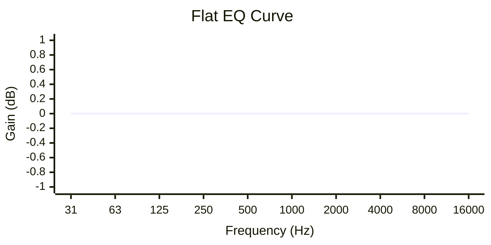

**Band-by-Band Breakdown:**

| Band | Freq | Gain | BW | Filter | Purpose |
|------|------|------|----|----|---------|
| 1-10 | Standard distribution | 0 dB | 1.0 | Parametric | Neutral reference |

**Why This Curve Works:**

The Flat preset is intentionally neutral. All bands are set to 0 dB gain with standard parametric filters and medium bandwidth (1.0 octaves). This provides:

1. **Accurate monitoring**: Hear the source material without coloration
2. **Reference point**: Compare other presets against this baseline
3. **Clean slate**: Start here when building custom curves

**Technical Notes:**
- Uses logarithmic frequency distribution (standard for EQ)
- All filters are parametric for consistency
- No input/output gain adjustment needed (0 dB)
- Active band count: 10 (standard configuration)

</details>

### Usage Tips

**Best with:**
- High-quality source material
- Reference monitoring
- Audio production work
- Comparing different audio systems

**Avoid with:**
- N/A (flat is always a valid choice)

**Common modifications:**
- Use as starting point for custom presets
- Add small adjustments to taste (e.g., +2 dB at 8 kHz for more air)

---

## 2. Bass Boost

**Purpose:** Add deep, punchy bass without muddiness

**Best for:**
- Hip-hop and rap
- EDM and electronic music
- Action movies and gaming
- Bass-heavy genres
- Speakers/headphones with good bass response

**Band count:** 12

### What It Does

The Bass Boost preset enhances low frequencies to give your audio more impact and depth. It focuses on the "punch" frequencies (around 60-100 Hz) that you feel in your chest, while carefully controlling the low-midrange to prevent the sound from becoming muddy or boomy.

The curve uses a combination of low shelf filters and surgical parametric EQ to create tight, focused bass rather than a broad, muddy boost. A subtle cut in the low-mids (400 Hz) prevents bass buildup from bleeding into the midrange.

<details>
<summary>🔧 Technical Breakdown (click to expand)</summary>

**EQ Curve Visualization:**

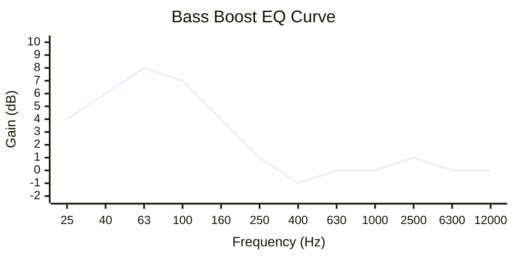

**Band-by-Band Breakdown:**

| Band | Freq | Gain | BW | Filter | Purpose |
|------|------|------|----|----|---------|
| 1 | 25 Hz | +4 dB | 1.2 | Low Shelf | Sub-bass foundation |
| 2 | 40 Hz | +6 dB | 0.9 | Parametric | Deep bass |
| 3 | 63 Hz | +8 dB | 0.8 | Parametric | **Bass punch (peak)** |
| 4 | 100 Hz | +7 dB | 0.9 | Parametric | Bass body |
| 5 | 160 Hz | +4 dB | 1.0 | Parametric | Upper bass |
| 6 | 250 Hz | +1 dB | 1.1 | Parametric | Transition |
| 7 | 400 Hz | -1 dB | 1.0 | Parametric | Reduce mud |
| 8 | 630 Hz | 0 dB | 1.0 | Parametric | Neutral |
| 9 | 1000 Hz | 0 dB | 1.0 | Parametric | Neutral |
| 10 | 2500 Hz | +1 dB | 1.0 | Parametric | Slight presence |
| 11 | 6300 Hz | 0 dB | 1.0 | Parametric | Neutral |
| 12 | 12000 Hz | 0 dB | 1.0 | Parametric | Neutral |

**Why This Curve Works:**

1. **Peak at 63 Hz**: This is the sweet spot for bass punch—the frequency you feel in your chest rather than just hear. It's the main impact frequency for kick drums and bass guitars.

2. **Low shelf at 25 Hz**: Adds sub-bass rumble (the "felt" bass below 30 Hz) without boosting problematic frequencies. The wide bandwidth (1.2) ensures a natural, gradual transition.

3. **Surgical cuts at 400 Hz**: Bass boost naturally pushes energy into the low-mids, which can create "mud" (boomy, unclear sound). The -1 dB cut at 400 Hz prevents this buildup while maintaining warmth.

4. **Narrow bandwidths (0.8-0.9)**: The peak frequencies use narrow bandwidths for focused, tight bass. This prevents the boost from bleeding into adjacent frequencies where it's not wanted.

5. **Gradual high-frequency rolloff**: The curve naturally returns to neutral above 1 kHz, preserving the original tonal balance of vocals and instruments.

6. **Input gain -5 dB**: This compensation prevents digital clipping when the bass boost is applied to already-loud content.

**Audio Engineering Principles:**
- **Complementary EQ**: The bass boost is balanced by mud reduction (400 Hz cut)
- **Targeted boost**: Peak frequency chosen based on human perception (chest punch)
- **Bandwidth control**: Narrow at peaks for focus, wide at shelves for natural sound
- **Gain staging**: Input compensation prevents clipping

</details>

### Usage Tips

**Best with:**
- Bass-capable speakers or headphones
- Genres that rely on low-end impact
- Movies and games with action sequences
- Music that needs more "weight"

**Avoid with:**
- Already bass-heavy content (risk of muddiness)
- Small speakers that can't reproduce low frequencies
- Audiobooks or podcasts (vocals will sound boomy)
- Bass-weak headphones (will sound thin, not punchy)

**Common modifications:**
- Want less bass? Reduce bands 2-4 by 2-3 dB
- Want deeper bass? Increase band 1 to +6 dB
- Too muddy? Increase the cut at band 7 to -2 dB
- Want more punch? Increase band 3 to +10 dB

---

## 3. Treble Boost

**Purpose:** Add brightness, clarity, and air without harshness

**Best for:**
- Classical and orchestral music
- Acoustic music
- Podcasts and audiobooks
- Older recordings that sound dull
- Small speakers that lack treble

**Band count:** 10

### What It Does

The Treble Boost preset enhances high frequencies to add brightness, clarity, and "air" to your audio. It focuses on the presence region (2-6 kHz) where clarity and definition live, while using a high shelf to add sparkle and space above 10 kHz.

The curve is carefully shaped to avoid harshness by using gradual transitions and avoiding excessive boost in the sibilance range (5-8 kHz). A subtle cut at 500 Hz reduces boxiness and prevents the boosted highs from sounding disconnected.

<details>
<summary>🔧 Technical Breakdown (click to expand)</summary>

**EQ Curve Visualization:**

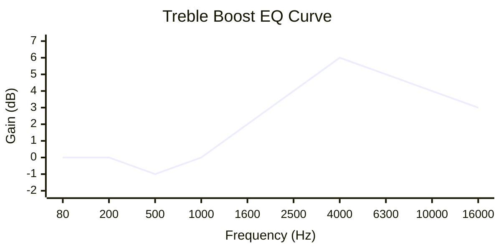

**Band-by-Band Breakdown:**

| Band | Freq | Gain | BW | Filter | Purpose |
|------|------|------|----|----|---------|
| 1 | 80 Hz | 0 dB | 1.0 | Parametric | Neutral |
| 2 | 200 Hz | 0 dB | 1.0 | Parametric | Neutral |
| 3 | 500 Hz | -1 dB | 1.0 | Parametric | Reduce boxiness |
| 4 | 1000 Hz | 0 dB | 1.0 | Parametric | Neutral |
| 5 | 1600 Hz | +2 dB | 1.0 | Parametric | Presence start |
| 6 | 2500 Hz | +4 dB | 0.9 | Parametric | Clarity |
| 7 | 4000 Hz | +6 dB | 0.8 | Parametric | **Presence (peak)** |
| 8 | 6300 Hz | +5 dB | 0.9 | Parametric | Brilliance |
| 9 | 10000 Hz | +4 dB | 1.1 | Parametric | Air |
| 10 | 16000 Hz | +3 dB | 1.3 | High Shelf | Sparkle |

**Why This Curve Works:**

1. **Peak at 4 kHz**: This is the primary presence frequency where clarity and definition live. It's high enough to add brightness but not so high as to cause harshness.

2. **High shelf at 16 kHz**: Adds air and sparkle above the audible presence region. The wide bandwidth (1.3) creates a smooth, natural transition that sounds like "opening up" the sound rather than a harsh treble boost.

3. **Gradual approach**: The boost starts gently at 1.6 kHz (+2 dB) and builds to the peak at 4 kHz. This prevents the treble from sounding disconnected or artificial.

4. **Cut at 500 Hz**: A subtle -1 dB cut reduces boxiness and prevents the low-mids from competing with the boosted highs. This creates better separation and clarity.

5. **Narrow bandwidths at peaks (0.8-0.9)**: The presence frequencies use narrow bandwidths for focused clarity without affecting adjacent frequencies.

6. **Input gain -3 dB**: Compensation prevents clipping from the high-frequency boost.

**Audio Engineering Principles:**
- **Presence peak**: 4 kHz is the sweet spot for clarity without harshness
- **Complementary EQ**: Low-mid cut (500 Hz) balances high boost
- **Gradual transitions**: Prevents harsh, artificial sound
- **Shelf for air**: High shelf creates natural sparkle

</details>

### Usage Tips

**Best with:**
- Classical and acoustic music
- Podcasts and audiobooks
- Older recordings that sound "dull"
- Small speakers or earbuds
- Music that needs more "life"

**Avoid with:**
- Already bright or harsh content
- Recordings with excessive sibilance
- Low-quality MP3s (will reveal artifacts)
- Bright headphones (risk of harshness)

**Common modifications:**
- Too bright? Reduce bands 7-8 by 2-3 dB
- Want more air? Increase band 10 to +5 dB
- Too harsh? Reduce band 8 to +3 dB
- Need more warmth? Increase band 2 to +2 dB

---

## 4. Vocal Presence

**Purpose:** Make vocals cut through clearly with enhanced intelligibility

**Best for:**
- Podcasts and audiobooks
- Voice calls and video conferencing
- Vocal-heavy music
- Dialogue in movies
- Any content where speech clarity matters

**Band count:** 14

### What It Does

The Vocal Presence preset is designed to make speech and vocals clear, present, and easy to understand. It uses a high-pass filter to remove low-frequency rumble, surgical cuts in the low-mids to reduce boominess, and precise boosts in the presence frequencies (1-4 kHz) where vocal clarity lives.

This is the most surgical of all presets, using 14 bands with narrow bandwidths to precisely shape the frequency response for optimal speech intelligibility.

<details>
<summary>🔧 Technical Breakdown (click to expand)</summary>

**EQ Curve Visualization:**

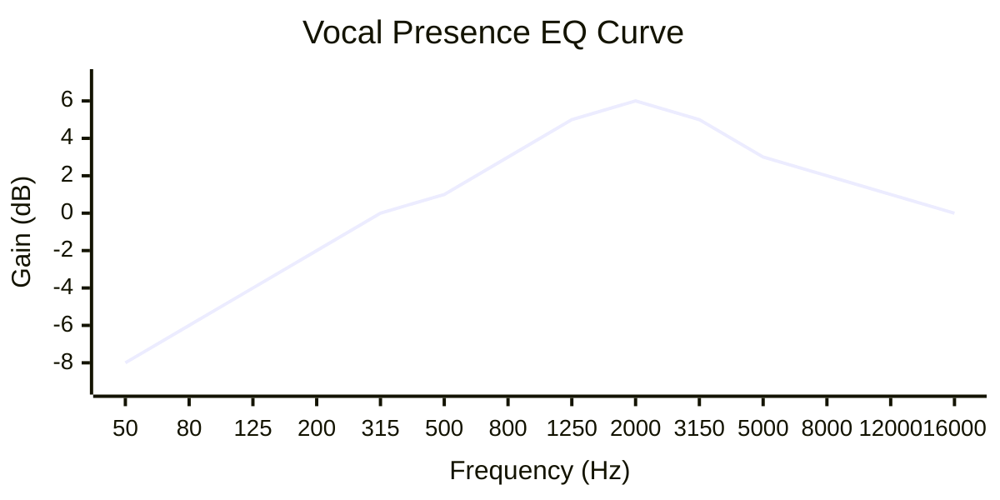

**Band-by-Band Breakdown:**

| Band | Freq | Gain | BW | Filter | Purpose |
|------|------|------|----|----|---------|
| 1 | 50 Hz | -8 dB | 1.5 | High Pass | Remove rumble |
| 2 | 80 Hz | -6 dB | 1.0 | Parametric | Reduce boom |
| 3 | 125 Hz | -4 dB | 1.0 | Parametric | Reduce mud |
| 4 | 200 Hz | -2 dB | 0.9 | Parametric | Reduce boxiness |
| 5 | 315 Hz | 0 dB | 1.0 | Parametric | Neutral (body) |
| 6 | 500 Hz | +1 dB | 1.0 | Parametric | Warmth |
| 7 | 800 Hz | +3 dB | 0.8 | Parametric | Presence start |
| 8 | 1250 Hz | +5 dB | 0.7 | Parametric | Presence |
| 9 | 2000 Hz | +6 dB | 0.7 | Parametric | **Clarity (peak)** |
| 10 | 3150 Hz | +5 dB | 0.8 | Parametric | Definition |
| 11 | 5000 Hz | +3 dB | 0.9 | Parametric | Cut-through |
| 12 | 8000 Hz | +2 dB | 1.0 | Parametric | Air |
| 13 | 12000 Hz | +1 dB | 1.1 | Parametric | Sparkle |
| 14 | 16000 Hz | 0 dB | 1.0 | Parametric | Neutral |

**Why This Curve Works:**

1. **High-pass filter at 50 Hz**: Removes sub-bass rumble and handling noise that can make vocals sound muddy. The wide bandwidth (1.5) creates a gentle slope.

2. **Surgical low-mid cuts (80-200 Hz)**: These frequencies cause "boom" and "mud" in vocals. The progressive cuts (-6, -4, -2 dB) create a natural high-pass shape without sounding thin.

3. **Peak at 2 kHz**: This is the primary vocal presence frequency. It's where the human ear is most sensitive to speech, and where vocals "cut through" a mix.

4. **Narrow bandwidths (0.7-0.8)**: The presence frequencies use very narrow bandwidths for surgical precision. This boosts exactly what's needed without affecting adjacent frequencies.

5. **Gentle high-frequency rolloff**: Above 5 kHz, the boost gradually decreases to avoid harshness and sibilance while still adding air and sparkle.

6. **Input gain -1 dB**: Minimal compensation needed because the cuts and boosts are balanced.

**Audio Engineering Principles:**
- **High-pass filtering**: Essential for clean vocals
- **Presence peak**: 2 kHz is the vocal clarity frequency
- **Surgical EQ**: Narrow bandwidths for precise control
- **Balanced curve**: Cuts and boosts complement each other
- **Sibilance control**: Gentle rolloff above 5 kHz

</details>

### Usage Tips

**Best with:**
- Podcasts and audiobooks
- Voice calls and video conferencing
- Dialogue-heavy content
- Vocal-heavy music
- Any content where speech clarity is critical

**Avoid with:**
- Bass-heavy music (will sound thin)
- Electronic music (removes the "weight")
- Content with significant low-frequency effects
- Music where bass instruments are important

**Common modifications:**
- Too thin? Reduce the cuts at bands 2-3
- Need more warmth? Increase band 6 to +2 dB
- Too harsh? Reduce band 9 to +4 dB
- Sibilance issues? Reduce band 11 to +1 dB

---

## 5. Loudness

**Purpose:** Compensate for human hearing sensitivity at low volumes

**Best for:**
- Night listening at low volumes
- Quiet environments
- Background music
- Any low-volume listening scenario

**Band count:** 10

### What It Does

The Loudness preset implements the classic "Fletcher-Munson" compensation curve. Human ears are less sensitive to bass and treble at low volumes, so this preset boosts both ends of the frequency spectrum to restore the perceived balance.

The result is a "smile curve" (boosted lows and highs) that makes low-volume listening sound more natural and full, rather than thin and mid-heavy.

<details>
<summary>🔧 Technical Breakdown (click to expand)</summary>

**EQ Curve Visualization:**

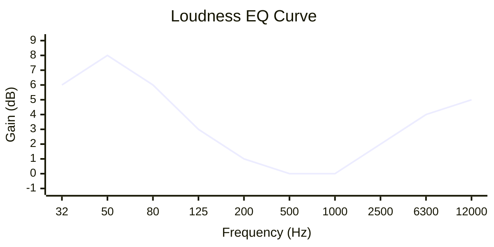

**Band-by-Band Breakdown:**

| Band | Freq | Gain | BW | Filter | Purpose |
|------|------|------|----|----|---------|
| 1 | 32 Hz | +6 dB | 1.4 | Low Shelf | Deep bass |
| 2 | 50 Hz | +8 dB | 1.0 | Parametric | **Bass (peak)** |
| 3 | 80 Hz | +6 dB | 1.0 | Parametric | Upper bass |
| 4 | 125 Hz | +3 dB | 1.2 | Parametric | Transition |
| 5 | 200 Hz | +1 dB | 1.3 | Parametric | Gentle rolloff |
| 6 | 500 Hz | 0 dB | 1.0 | Parametric | Neutral |
| 7 | 1000 Hz | 0 dB | 1.0 | Parametric | Neutral |
| 8 | 2500 Hz | +2 dB | 1.1 | Parametric | Presence start |
| 9 | 6300 Hz | +4 dB | 1.2 | Parametric | Brilliance |
| 10 | 12000 Hz | +5 dB | 1.4 | High Shelf | **Air (peak)** |

**Why This Curve Works:**

1. **Fletcher-Munson principle**: At low volumes, human ears are less sensitive to frequencies below 500 Hz and above 4 kHz. This curve compensates for that natural hearing curve.

2. **Bass peak at 50 Hz**: The primary bass boost targets the frequency where low-volume sensitivity loss is most pronounced. This restores the "weight" and "punch" that disappears at low volumes.

3. **High shelf at 12 kHz**: Adds air and brilliance that's lost at low volumes. The wide bandwidth (1.4) creates a smooth, natural transition.

4. **Wide bandwidths (1.2-1.4)**: The curve uses wide bandwidths for smooth, musical transitions. This sounds more natural than surgical boosts.

5. **Neutral mids**: The midrange (500-1000 Hz) is left untouched because human hearing is most sensitive in this range, even at low volumes.

6. **Input gain -4 dB**: Compensation prevents clipping from the significant bass and treble boosts.

**Audio Engineering Principles:**
- **Fletcher-Munson curve**: Based on 1933 research on human hearing sensitivity
- **Equal-loudness contours**: The curve follows the natural shape of human hearing
- **Smile curve**: Classic loudness EQ shape (boosted lows and highs)
- **Wide bandwidths**: Musical, natural-sounding compensation

</details>

### Usage Tips

**Best with:**
- Low-volume listening (night mode)
- Quiet environments (office, library)
- Background music
- Small speakers at low volumes
- Any scenario where you can't turn up the volume

**Avoid with:**
- Normal or loud volumes (will sound boomy and harsh)
- Already bass-heavy or bright content
- High-quality monitoring at normal volumes

**Common modifications:**
- Too much bass? Reduce bands 2-3 by 2-3 dB
- Too bright? Reduce band 10 to +3 dB
- Need more presence? Increase band 8 to +3 dB
- For very low volumes, increase all boosts by 2-3 dB

---

## 6. Acoustic

**Purpose:** Warm, natural sound for acoustic instruments and vocals

**Best for:**
- Acoustic guitar and piano
- Singer-songwriter music
- Folk and country
- Unplugged performances
- Any acoustic or organic music

**Band count:** 11

### What It Does

The Acoustic preset creates a warm, natural tone that enhances the organic character of acoustic instruments. It adds warmth in the low-mids, a subtle scoop in the midrange for clarity, and gentle presence in the upper-mids for definition.

The curve uses wide bandwidths and shelf filters to create smooth, musical transitions that sound natural rather than processed.

<details>
<summary>🔧 Technical Breakdown (click to expand)</summary>

**EQ Curve Visualization:**

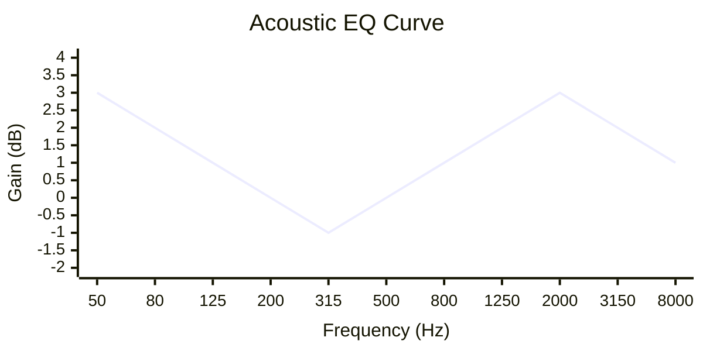

**Band-by-Band Breakdown:**

| Band | Freq | Gain | BW | Filter | Purpose |
|------|------|------|----|----|---------|
| 1 | 50 Hz | +3 dB | 1.3 | Low Shelf | Warmth/body |
| 2 | 80 Hz | +2 dB | 1.1 | Parametric | Acoustic body |
| 3 | 125 Hz | +1 dB | 1.0 | Parametric | Fullness |
| 4 | 200 Hz | 0 dB | 1.0 | Parametric | Neutral |
| 5 | 315 Hz | -1 dB | 1.0 | Parametric | Slight scoop |
| 6 | 500 Hz | 0 dB | 1.0 | Parametric | Neutral |
| 7 | 800 Hz | +1 dB | 1.0 | Parametric | Natural presence |
| 8 | 1250 Hz | +2 dB | 0.9 | Parametric | Clarity |
| 9 | 2000 Hz | +3 dB | 0.8 | Parametric | **Definition (peak)** |
| 10 | 3150 Hz | +2 dB | 1.0 | Parametric | Sparkle |
| 11 | 8000 Hz | +1 dB | 1.2 | High Shelf | Air |

**Why This Curve Works:**

1. **Low shelf at 50 Hz**: Adds warmth and body to acoustic instruments. The wide bandwidth (1.3) creates a natural, gradual transition.

2. **Mid scoop at 315 Hz**: A subtle -1 dB cut creates the characteristic "acoustic scoop" that gives clarity and separation. This prevents the low-mids from building up and sounding muddy.

3. **Peak at 2 kHz**: This is the definition frequency for acoustic instruments—where the "pluck" of a guitar string or the "attack" of a piano key lives.

4. **Wide bandwidths (1.0-1.3)**: The curve uses wide bandwidths for smooth, musical transitions. This sounds more natural than surgical EQ.

5. **High shelf at 8 kHz**: Adds gentle air and sparkle without harshness. The wide bandwidth creates a smooth, natural top end.

6. **Input gain -2 dB**: Compensation prevents clipping from the warmth and presence boosts.

**Audio Engineering Principles:**
- **Warmth without mud**: Low shelf adds body, mid scoop prevents buildup
- **Natural transitions**: Wide bandwidths for organic sound
- **Presence peak**: 2 kHz for acoustic definition
- **Gentle air**: High shelf for natural sparkle

</details>

### Usage Tips

**Best with:**
- Acoustic guitar and piano
- Singer-songwriter music
- Folk, country, and Americana
- Unplugged and live recordings
- Any organic, natural music

**Avoid with:**
- Electronic and synthesized music
- Heavy rock and metal
- Bass-heavy genres
- Music that needs aggressive character

**Common modifications:**
- Want more warmth? Increase band 1 to +5 dB
- Too muddy? Increase the cut at band 5 to -2 dB
- Need more clarity? Increase band 9 to +5 dB
- Want more air? Increase band 11 to +3 dB

---

## 7. Rock

**Purpose:** Aggressive, punchy sound with scooped mids

**Best for:**
- Classic rock and hard rock
- Metal and heavy music
- Alternative and punk
- Any aggressive guitar-driven music

**Band count:** 12

### What It Does

The Rock preset creates the classic "V-shaped" or "scooped mid" EQ curve that's characteristic of rock and metal music. It boosts the lows for punch and weight, cuts the midrange for clarity and aggression, and boosts the highs for bite and edge.

This curve mimics the natural EQ curve of high-gain guitar amplifiers and creates the aggressive, in-your-face sound that rock music is known for.

<details>
<summary>🔧 Technical Breakdown (click to expand)</summary>

**EQ Curve Visualization:**

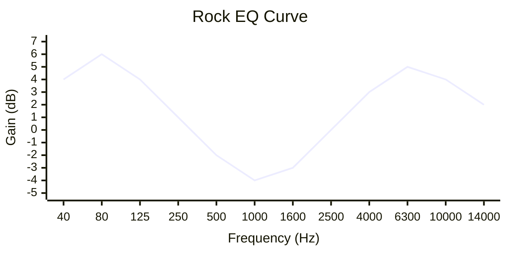

**Band-by-Band Breakdown:**

| Band | Freq | Gain | BW | Filter | Purpose |
|------|------|------|----|----|---------|
| 1 | 40 Hz | +4 dB | 1.1 | Low Shelf | Sub-bass |
| 2 | 80 Hz | +6 dB | 0.9 | Parametric | **Punch** |
| 3 | 125 Hz | +4 dB | 1.0 | Parametric | Body |
| 4 | 250 Hz | +1 dB | 1.0 | Parametric | Transition |
| 5 | 500 Hz | -2 dB | 1.0 | Parametric | Scoop start |
| 6 | 1000 Hz | -4 dB | 0.9 | Parametric | **Mid scoop** |
| 7 | 1600 Hz | -3 dB | 0.9 | Parametric | Scoop |
| 8 | 2500 Hz | 0 dB | 1.0 | Parametric | Neutral |
| 9 | 4000 Hz | +3 dB | 0.9 | Parametric | Aggression |
| 10 | 6300 Hz | +5 dB | 0.9 | Parametric | **Bite** |
| 11 | 10000 Hz | +4 dB | 1.0 | Parametric | Air |
| 12 | 14000 Hz | +2 dB | 1.1 | High Shelf | Sparkle |

**Why This Curve Works:**

1. **V-shaped curve**: The classic rock EQ shape—boosted lows and highs, scooped mids. This creates the aggressive, powerful sound that rock music is known for.

2. **Bass punch at 80 Hz**: The primary low-end boost targets the punch frequency. This gives drums and bass guitar the impact they need in rock music.

3. **Mid scoop (1-1.6 kHz)**: The -4 dB cut at 1 kHz creates the "scooped" sound that makes guitars sound aggressive and drums sound powerful. This is the signature of rock EQ.

4. **High-frequency bite (6.3 kHz)**: The +5 dB boost adds the "bite" and "edge" that distorted guitars need to cut through the mix.

5. **Narrow bandwidths (0.9)**: The scoop and peak frequencies use narrow bandwidths for focused, surgical control.

6. **Input gain -2 dB**: Compensation prevents clipping from the significant boosts.

**Audio Engineering Principles:**
- **V-shaped EQ**: Classic rock curve (boosted lows/highs, scooped mids)
- **Punch frequency**: 80 Hz for drum and bass impact
- **Mid scoop**: Creates aggression and power
- **Bite frequency**: 6.3 kHz for guitar edge

</details>

### Usage Tips

**Best with:**
- Classic rock and hard rock
- Metal and heavy music
- Alternative and punk
- Guitar-driven music
- Aggressive, powerful content

**Avoid with:**
- Jazz and classical
- Acoustic music
- Electronic music (use Electronic preset instead)
- Music that needs warmth and smoothness

**Common modifications:**
- Want more aggression? Increase the mid scoop to -6 dB
- Too scooped? Reduce the cuts at bands 6-7
- Need more punch? Increase band 2 to +8 dB
- Too harsh? Reduce band 10 to +3 dB

---

## 8. Electronic

**Purpose:** Tight bass and bright highs for modern electronic music

**Best for:**
- EDM and techno
- House and trance
- Dubstep and bass music
- Any electronic dance music

**Band count:** 13

### What It Does

The Electronic preset is designed for modern electronic music, with very tight, focused bass and bright, present highs. It uses surgical EQ with narrow bandwidths to create the precise, controlled sound that electronic music demands.

The curve emphasizes the "drop" frequencies (50-80 Hz) for bass impact and the "presence" frequencies (3-5 kHz) for clarity and energy.

<details>
<summary>🔧 Technical Breakdown (click to expand)</summary>

**EQ Curve Visualization:**

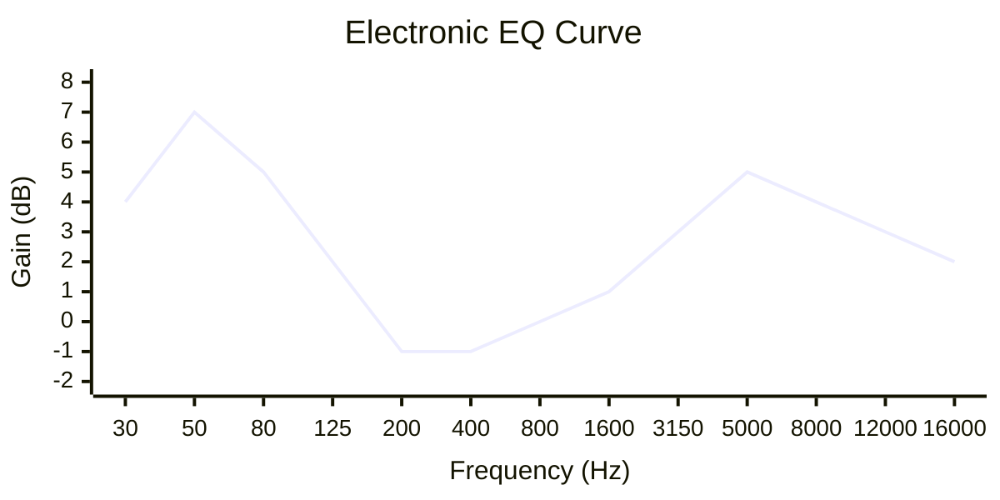

**Band-by-Band Breakdown:**

| Band | Freq | Gain | BW | Filter | Purpose |
|------|------|------|----|----|---------|
| 1 | 30 Hz | +4 dB | 1.0 | Low Shelf | Sub-bass |
| 2 | 50 Hz | +7 dB | 0.7 | Parametric | **Tight bass (peak)** |
| 3 | 80 Hz | +5 dB | 0.8 | Parametric | Bass punch |
| 4 | 125 Hz | +2 dB | 0.9 | Parametric | Body |
| 5 | 200 Hz | -1 dB | 1.0 | Parametric | Reduce mud |
| 6 | 400 Hz | -1 dB | 1.0 | Parametric | Reduce mud |
| 7 | 800 Hz | 0 dB | 1.0 | Parametric | Neutral |
| 8 | 1600 Hz | +1 dB | 1.0 | Parametric | Presence |
| 9 | 3150 Hz | +3 dB | 0.8 | Parametric | Clarity |
| 10 | 5000 Hz | +5 dB | 0.8 | Parametric | **Bright (peak)** |
| 11 | 8000 Hz | +4 dB | 1.0 | Parametric | Air |
| 12 | 12000 Hz | +3 dB | 1.1 | Parametric | Sparkle |
| 13 | 16000 Hz | +2 dB | 1.2 | High Shelf | Top end |

**Why This Curve Works:**

1. **Very tight bass (50 Hz)**: The +7 dB boost with narrow bandwidth (0.7) creates focused, punchy bass that's essential for electronic music. This is the "drop" frequency.

2. **Sub-bass shelf (30 Hz)**: Adds the sub-bass rumble that you feel in your chest at clubs and festivals.

3. **Mud reduction (200-400 Hz)**: Cuts in the low-mids prevent bass buildup from bleeding into the midrange, keeping the bass tight and controlled.

4. **Presence peak (5 kHz)**: The +5 dB boost adds the energy and brightness that electronic music needs to sound exciting and present.

5. **Very narrow bandwidths (0.7-0.8)**: The peak frequencies use very narrow bandwidths for surgical precision. This is critical for electronic music where precision matters.

6. **Input gain -3.5 dB**: Significant compensation prevents clipping from the substantial bass and treble boosts.

**Audio Engineering Principles:**
- **Surgical bass**: Narrow bandwidth for tight, controlled low end
- **Drop frequency**: 50 Hz is the EDM bass sweet spot
- **Mud control**: Low-mid cuts keep bass focused
- **Energy peak**: 5 kHz for electronic music brightness
- **Precision EQ**: Narrow bandwidths for surgical control

</details>

### Usage Tips

**Best with:**
- EDM and techno
- House and trance
- Dubstep and bass music
- Electronic dance music
- Club and festival music

**Avoid with:**
- Acoustic music
- Jazz and classical
- Rock (use Rock preset instead)
- Music that needs warmth and smoothness

**Common modifications:**
- Want more bass? Increase band 2 to +9 dB
- Too bright? Reduce band 10 to +3 dB
- Need more sub? Increase band 1 to +6 dB
- Bass too tight? Increase bandwidth at band 2 to 1.0

---

## 9. Jazz

**Purpose:** Warm, smooth sound for classic jazz

**Best for:**
- Classic and modern jazz
- Blues and soul
- R&B and funk
- Any music that needs warmth and smoothness

**Band count:** 10

### What It Does

The Jazz preset creates a warm, smooth tone that's perfect for jazz and related genres. It emphasizes the warm frequencies (125-500 Hz) while keeping the highs smooth and gentle rather than bright and harsh.

The curve uses wide bandwidths and subtle adjustments to create a natural, organic sound that enhances the warmth and richness of jazz recordings.

<details>
<summary>🔧 Technical Breakdown (click to expand)</summary>

**EQ Curve Visualization:**

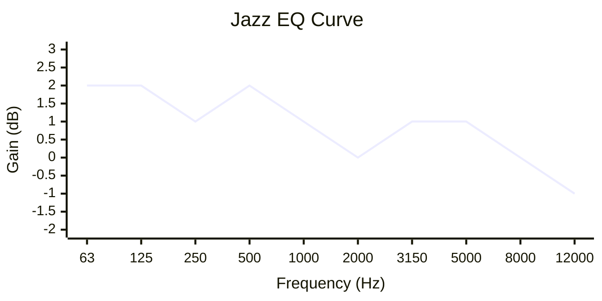

**Band-by-Band Breakdown:**

| Band | Freq | Gain | BW | Filter | Purpose |
|------|------|------|----|----|---------|
| 1 | 63 Hz | +2 dB | 1.2 | Low Shelf | Warmth |
| 2 | 125 Hz | +2 dB | 1.1 | Parametric | Body |
| 3 | 250 Hz | +1 dB | 1.0 | Parametric | Fullness |
| 4 | 500 Hz | +2 dB | 1.0 | Parametric | **Warmth (peak)** |
| 5 | 1000 Hz | +1 dB | 1.0 | Parametric | Presence |
| 6 | 2000 Hz | 0 dB | 1.0 | Parametric | Neutral |
| 7 | 3150 Hz | +1 dB | 1.1 | Parametric | Smooth presence |
| 8 | 5000 Hz | +1 dB | 1.1 | Parametric | Air |
| 9 | 8000 Hz | 0 dB | 1.0 | Parametric | Neutral |
| 10 | 12000 Hz | -1 dB | 1.2 | High Shelf | Smooth top |

**Why This Curve Works:**

1. **Warmth peak at 500 Hz**: The +2 dB boost in the low-mids adds the warmth and richness that's characteristic of jazz recordings. This is where the "body" of many jazz instruments lives.

2. **Low shelf at 63 Hz**: Adds subtle warmth and fullness to the low end without making it boomy.

3. **Smooth highs**: The gentle -1 dB high shelf at 12 kHz rolls off the extreme highs for a smoother, less harsh sound. This is characteristic of vintage jazz recordings.

4. **Wide bandwidths (1.0-1.2)**: The curve uses wide bandwidths for smooth, musical transitions. This sounds more natural and organic than surgical EQ.

5. **Subtle adjustments**: All adjustments are small (±1-2 dB) to maintain the natural character of the music while enhancing warmth.

6. **Input gain -1.5 dB**: Compensation prevents clipping from the warmth boosts.

**Audio Engineering Principles:**
- **Warmth emphasis**: Low-mid boost for jazz character
- **Smooth highs**: Gentle rolloff for vintage sound
- **Wide bandwidths**: Musical, natural transitions
- **Subtle adjustments**: Enhance without changing character

</details>

### Usage Tips

**Best with:**
- Classic and modern jazz
- Blues and soul
- R&B and funk
- Any music that needs warmth
- Vintage recordings

**Avoid with:**
- Electronic music
- Rock and metal
- Music that needs brightness and edge
- Modern pop and hip-hop

**Common modifications:**
- Want more warmth? Increase band 4 to +4 dB
- Too warm? Reduce bands 2-4 by 1 dB
- Need more presence? Increase band 7 to +2 dB
- Want vintage sound? Increase the cut at band 10 to -2 dB

---

## 10. Podcast

**Purpose:** Optimized for spoken word content

**Best for:**
- Podcasts
- Audiobooks
- Voice calls and video conferencing
- Any speech-only content

**Band count:** 12

### What It Does

The Podcast preset is specifically designed for spoken word content. It uses an aggressive high-pass filter to remove rumble, surgical cuts in the low-mids to reduce boominess, precise boosts in the presence frequencies for clarity, and a subtle cut in the sibilance range to reduce harsh "s" sounds.

This is the most speech-optimized preset, focusing entirely on intelligibility and clarity.

<details>
<summary>🔧 Technical Breakdown (click to expand)</summary>

**EQ Curve Visualization:**

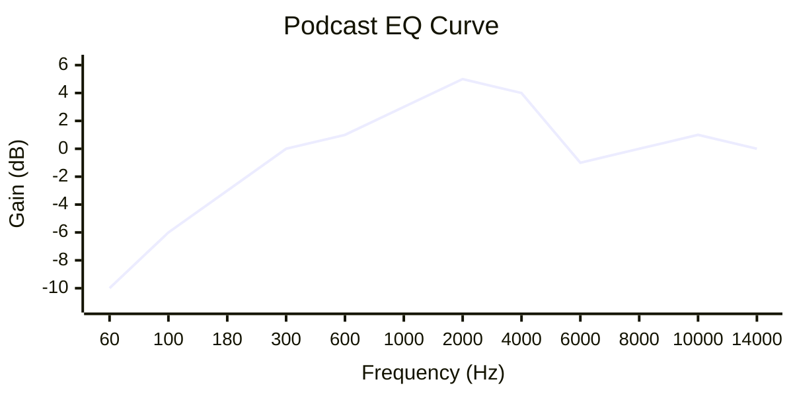

**Band-by-Band Breakdown:**

| Band | Freq | Gain | BW | Filter | Purpose |
|------|------|------|----|----|---------|
| 1 | 60 Hz | -10 dB | 1.5 | High Pass | Remove rumble |
| 2 | 100 Hz | -6 dB | 1.0 | Parametric | Reduce boom |
| 3 | 180 Hz | -3 dB | 0.9 | Parametric | Reduce mud |
| 4 | 300 Hz | 0 dB | 1.0 | Parametric | Neutral (body) |
| 5 | 600 Hz | +1 dB | 1.0 | Parametric | Warmth |
| 6 | 1000 Hz | +3 dB | 0.8 | Parametric | Presence |
| 7 | 2000 Hz | +5 dB | 0.7 | Parametric | **Clarity (peak)** |
| 8 | 4000 Hz | +4 dB | 0.8 | Parametric | Definition |
| 9 | 6000 Hz | -1 dB | 1.0 | Parametric | Reduce sibilance |
| 10 | 8000 Hz | 0 dB | 1.0 | Parametric | Neutral |
| 11 | 10000 Hz | +1 dB | 1.1 | Parametric | Air |
| 12 | 14000 Hz | 0 dB | 1.0 | Parametric | Neutral |

**Why This Curve Works:**

1. **Aggressive high-pass (60 Hz)**: The -10 dB cut with wide bandwidth (1.5) removes rumble, handling noise, and room tone that can make speech sound muddy and unprofessional.

2. **Low-mid cuts (100-180 Hz)**: These frequencies cause "boom" in male voices. The progressive cuts create a natural high-pass shape.

3. **Presence peak at 2 kHz**: The +5 dB boost at the primary vocal presence frequency makes speech cut through clearly. This is where the human ear is most sensitive to speech.

4. **Sibilance reduction (6 kHz)**: The -1 dB cut reduces harsh "s" and "sh" sounds without making speech sound dull. This is critical for comfortable listening.

5. **Narrow bandwidths (0.7-0.8)**: The presence frequencies use narrow bandwidths for surgical precision.

6. **Input gain -0.5 dB**: Minimal compensation needed because cuts and boosts are balanced.

**Audio Engineering Principles:**
- **High-pass filtering**: Essential for clean speech
- **Presence boost**: 2 kHz for vocal clarity
- **Sibilance control**: Cut at 6 kHz for comfort
- **Surgical EQ**: Narrow bandwidths for precision
- **Balanced curve**: Cuts and boosts complement each other

</details>

### Usage Tips

**Best with:**
- Podcasts and audiobooks
- Voice calls and video conferencing
- Speech-only content
- Dialogue in videos
- Any content where speech clarity is critical

**Avoid with:**
- Music (will sound thin)
- Content with significant low-frequency effects
- Bass-heavy content
- Music where instruments matter

**Common modifications:**
- Too thin? Reduce the cuts at bands 1-2
- Sibilance issues? Increase the cut at band 9 to -2 dB
- Need more warmth? Increase band 5 to +2 dB
- Too harsh? Reduce band 7 to +3 dB

---

## 11. Classical

**Purpose:** Neutral, refined sound for orchestral music

**Best for:**
- Orchestral and symphonic music
- Chamber music
- Solo classical instruments
- Opera and choral music

**Band count:** 9

### What It Does

The Classical preset provides a very neutral, refined response that's perfect for classical music. It makes only the subtlest adjustments—a touch of warmth in the lows and a gentle smoothness in the highs—to enhance the natural beauty of acoustic instruments without coloring the sound.

This is the most neutral preset after Flat, designed to preserve the authentic character of classical recordings.

<details>
<summary>🔧 Technical Breakdown (click to expand)</summary>

**EQ Curve Visualization:**

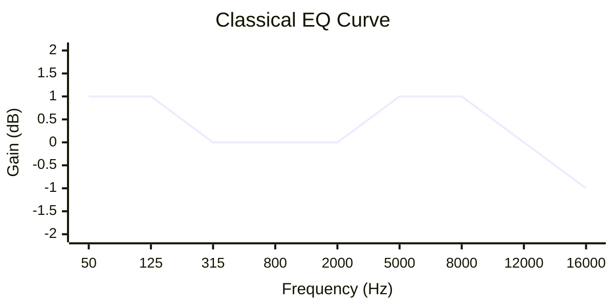

**Band-by-Band Breakdown:**

| Band | Freq | Gain | BW | Filter | Purpose |
|------|------|------|----|----|---------|
| 1 | 50 Hz | +1 dB | 1.3 | Low Shelf | Slight warmth |
| 2 | 125 Hz | +1 dB | 1.1 | Parametric | Body |
| 3 | 315 Hz | 0 dB | 1.0 | Parametric | Neutral |
| 4 | 800 Hz | 0 dB | 1.0 | Parametric | Neutral |
| 5 | 2000 Hz | 0 dB | 1.0 | Parametric | Neutral |
| 6 | 5000 Hz | +1 dB | 1.1 | Parametric | Slight presence |
| 7 | 8000 Hz | +1 dB | 1.2 | Parametric | Air |
| 8 | 12000 Hz | 0 dB | 1.0 | Parametric | Neutral |
| 9 | 16000 Hz | -1 dB | 1.2 | High Shelf | Smooth top |

**Why This Curve Works:**

1. **Minimal adjustments**: All adjustments are ±1 dB or less, preserving the natural character of classical recordings.

2. **Slight warmth (50-125 Hz)**: The +1 dB low shelf adds subtle warmth and fullness without coloring the sound. This enhances the natural resonance of acoustic instruments.

3. **Neutral mids**: The midrange (315-2000 Hz) is left completely untouched. This is where most classical instruments have their fundamental frequencies, and any adjustment would color the sound.

4. **Gentle air (5-8 kHz)**: The +1 dB boosts add subtle air and presence without making the sound bright or harsh.

5. **Smooth top (16 kHz)**: The -1 dB high shelf rolls off the extreme highs for a smoother, more refined sound. This mimics the natural rolloff of acoustic instruments and concert halls.

6. **Wide bandwidths (1.1-1.3)**: The curve uses wide bandwidths for smooth, natural transitions.

7. **Input gain -0.5 dB**: Minimal compensation needed for the subtle adjustments.

**Audio Engineering Principles:**
- **Minimal intervention**: Preserve natural character
- **Subtle warmth**: Enhance without coloring
- **Neutral mids**: Don't alter fundamental frequencies
- **Smooth highs**: Refined, not bright
- **Wide bandwidths**: Natural transitions

</details>

### Usage Tips

**Best with:**
- Orchestral and symphonic music
- Chamber music and solo instruments
- Opera and choral music
- Any acoustic classical recording
- High-quality audio systems

**Avoid with:**
- Bass-heavy genres
- Electronic music
- Rock and pop
- Music that needs enhancement

**Common modifications:**
- Want more warmth? Increase band 1 to +2 dB
- Too bright? Increase the cut at band 9 to -2 dB
- Need more presence? Increase band 6 to +2 dB
- For very neutral sound, use Flat preset instead

---

## Frequency Range Reference

### Instrument Frequency Chart

| Instrument | Fundamental Range | Key Harmonics | EQ Sweet Spots | Problem Frequencies |
|------------|-------------------|---------------|----------------|---------------------|
| **Kick Drum** | 60-100 Hz | 1-3 kHz | Punch: 80 Hz, Click: 2-3 kHz | Mud: 200-400 Hz |
| **Snare Drum** | 150-250 Hz | 3-5 kHz | Body: 200 Hz, Crisp: 5 kHz | Boxiness: 400-800 Hz |
| **Bass Guitar** | 80-250 Hz | 700 Hz-1.5 kHz | Growl: 700 Hz, Punch: 100 Hz | Mud: 200-300 Hz |
| **Electric Guitar** | 100-400 Hz | 1.5-4 kHz | Body: 200 Hz, Presence: 3 kHz | Mud: 200-400 Hz, Harsh: 4-6 kHz |
| **Acoustic Guitar** | 100-400 Hz | 2-5 kHz | Warmth: 200 Hz, Sparkle: 3-5 kHz | Boom: 200 Hz, Harsh: 2-3 kHz |
| **Piano** | 80 Hz-4 kHz | 5-12 kHz | Body: 200-400 Hz, Presence: 2-5 kHz | Mud: 200-400 Hz |
| **Violin** | 200 Hz-2 kHz | 3-10 kHz | Body: 400 Hz, Brilliance: 5-8 kHz | Nasal: 1-2 kHz |
| **Cello** | 65-500 Hz | 1-5 kHz | Warmth: 200-300 Hz, Presence: 2-3 kHz | Mud: 200-400 Hz |
| **Flute** | 250-2.5 kHz | 3-8 kHz | Body: 500-800 Hz, Air: 5-8 kHz | Harsh: 2-3 kHz |
| **Saxophone** | 125-800 Hz | 2-6 kHz | Body: 200-400 Hz, Edge: 2-3 kHz | Harsh: 3-5 kHz |
| **Trumpet** | 150-1 kHz | 2-8 kHz | Body: 300-500 Hz, Brilliance: 5-8 kHz | Harsh: 3-5 kHz |
| **Male Vocals** | 100-400 Hz | 1-8 kHz | Warmth: 200 Hz, Presence: 2-4 kHz | Mud: 200-300 Hz, Sibilance: 5-8 kHz |
| **Female Vocals** | 200-800 Hz | 1.5-10 kHz | Body: 300-500 Hz, Presence: 2-5 kHz | Boxiness: 500-800 Hz, Sibilance: 5-8 kHz |
| **Synthesizer** | 30 Hz-10 kHz | Varies | Sub: 40-80 Hz, Presence: 2-5 kHz | Mud: 200-400 Hz |
| **Orchestra** | 30 Hz-15 kHz | Full spectrum | Warmth: 100-300 Hz, Air: 8-12 kHz | Mud: 200-400 Hz |

### Frequency Range Quick Guide

| Range | Frequencies | Character | Instruments | Common Issues |
|-------|-------------|-----------|-------------|---------------|
| **Sub-bass** | 20-60 Hz | Rumble, power, felt | Kick drum, synth bass, pipe organ | Speaker distortion, inaudible on small speakers |
| **Bass** | 60-250 Hz | Punch, warmth, foundation | Bass guitar, kick, piano left hand | Boominess, mud if excessive |
| **Low-mids** | 250-500 Hz | Body, fullness | Guitar, piano, vocals | Mud, boxiness, buildup |
| **Mids** | 500-2000 Hz | Presence, intelligibility | Vocals, most instruments | Nasal quality, honk |
| **Upper-mids** | 2000-6000 Hz | Clarity, definition, edge | Vocal presence, guitar attack | Harshness, sibilance, fatigue |
| **Highs** | 6000-12000 Hz | Air, brilliance, sparkle | Cymbals, strings, vocals | Harshness, brightness |
| **Extreme highs** | 12000-20000 Hz | Air, shimmer, space | Overtones, room ambience | Mostly felt, can cause fatigue |

---

## Glossary of Audio Terms

**Bandwidth**: The range of frequencies affected by an EQ band, measured in octaves. Narrow bandwidth (0.7-0.9) = precise, surgical control. Wide bandwidth (1.1-1.5) = smooth, musical sound.

**Boominess**: Excessive low-mid frequencies (200-400 Hz) that make sound muddy and unclear. Often caused by room acoustics or excessive bass boost.

**Boxiness**: A hollow, "boxy" sound caused by excessive frequencies around 400-800 Hz. Common in small rooms or poorly recorded audio.

**Clipping**: Digital distortion that occurs when audio levels exceed 0 dB. Prevented by reducing input gain when boosting frequencies.

**Complementary EQ**: Technique where boosts in one frequency range are balanced by cuts in another. Used to prevent frequency buildup.

**Fletcher-Munson Curve**: Scientific principle that human ears are less sensitive to bass and treble at low volumes. The "Loudness" preset compensates for this.

**Fundamental Frequency**: The lowest frequency of a sound, which determines its pitch. For example, A4 on a piano has a fundamental of 440 Hz.

**Harmonics**: Frequencies above the fundamental that give instruments their unique tone. Also called overtones.

**High-Pass Filter**: EQ that removes frequencies below a cutoff point. Used to clean up rumble and low-frequency noise. Also called "low-cut."

**High Shelf**: EQ that boosts or cuts all frequencies above a certain point, with a gradual transition. Used for broad treble adjustments.

**Low Shelf**: EQ that boosts or cuts all frequencies below a certain point, with a gradual transition. Used for broad bass adjustments.

**Mud**: Boomy, unclear sound typically caused by excessive buildup in the 200-400 Hz range. The most common EQ problem.

**Nasal**: A honking, "nose-like" quality caused by excessive frequencies around 800-1500 Hz.

**Octave**: A doubling of frequency. For example, 100 Hz to 200 Hz is one octave. Bandwidth is measured in octaves.

**Parametric EQ**: The most versatile EQ type, allowing control of frequency, gain, and bandwidth independently.

**Presence**: The quality that makes sounds "cut through" a mix. Typically associated with frequencies around 2-4 kHz for vocals.

**Q Factor**: Technical measure of bandwidth. Higher Q = narrower bandwidth. Q = center frequency ÷ bandwidth (in Hz).

**Resonance**: A peak in frequency response, often unwanted. Can cause harshness or "ringing" in audio.

**Sibilance**: Harsh "s" and "sh" sounds in vocals, typically around 5-8 kHz. Can be reduced with careful EQ.

**Shelf EQ**: EQ that creates gradual transitions above (high shelf) or below (low shelf) a frequency point. More natural-sounding than parametric for broad adjustments.

**Surgical EQ**: Precise, narrow-bandwidth EQ used to target specific problem frequencies. Opposite of "broad" or "musical" EQ.

**Warmth**: A pleasant, full sound associated with boosted low-mids (100-300 Hz). Opposite of "thin" or "bright."

---

## Customization Tips

### Common Adjustments

**"I want more bass"**
- Start with Bass Boost preset
- Increase bands 2-4 (40-100 Hz) by 2-3 dB
- If muddy, increase cut at band 7 (400 Hz) to -2 dB

**"I want more clarity"**
- Start with Treble Boost or Vocal Presence preset
- Increase bands around 2-4 kHz by 2-3 dB
- If harsh, reduce boost at 5-8 kHz

**"The sound is too muddy"**
- Cut frequencies around 200-400 Hz by 2-4 dB
- Use narrow bandwidth (0.8-0.9) for surgical control
- Consider high-pass filter at 80-100 Hz

**"The sound is too harsh"**
- Cut frequencies around 4-6 kHz by 2-3 dB
- Use narrow bandwidth (0.8) to target harshness
- Check for sibilance at 5-8 kHz

**"Vocals aren't clear enough"**
- Start with Vocal Presence or Podcast preset
- Boost around 2-3 kHz by 2-4 dB
- Cut low-mids (200-400 Hz) by 2-3 dB
- Add high-pass filter at 80-100 Hz

**"I want more warmth"**
- Boost frequencies around 100-300 Hz by 2-3 dB
- Use wide bandwidth (1.2-1.4) for natural sound
- Start with Jazz or Acoustic preset

### When to Modify vs. Create New

**Modify existing preset when:**
- You like the overall character but want small tweaks
- The preset is 80% right for your needs
- You're making temporary adjustments for specific content

**Create new preset when:**
- No existing preset matches your needs
- You want a completely different character
- You're building a signature sound for regular use

### Best Practices

1. **Start subtle**: Make small adjustments (1-2 dB) first
2. **Use bypass**: Compare with the original sound frequently
3. **Trust your ears**: If it sounds good, it is good
4. **Consider the source**: Different content needs different EQ
5. **Avoid solo**: EQ in context of the full mix, not isolated
6. **Less is more**: Small, precise adjustments often work better than large, broad ones

---

## Conclusion

The 11 factory presets in Equaliser are designed to cover a wide range of listening scenarios and musical genres. Each preset is carefully crafted using audio engineering principles to achieve its specific goal.

Remember:
- **Flat** is your neutral reference point
- **Bass/Treble Boost** for general tonal shaping
- **Vocal Presence/Podcast** for speech clarity
- **Loudness** for low-volume listening
- **Genre presets** (Rock, Electronic, Jazz, Classical, Acoustic) for specific music styles

Don't be afraid to modify presets to suit your personal taste or specific content. The best EQ is the one that sounds good to your ears in your listening environment.

Happy listening!

---

*Document version: 1.0*
*Last updated: March 2026*
