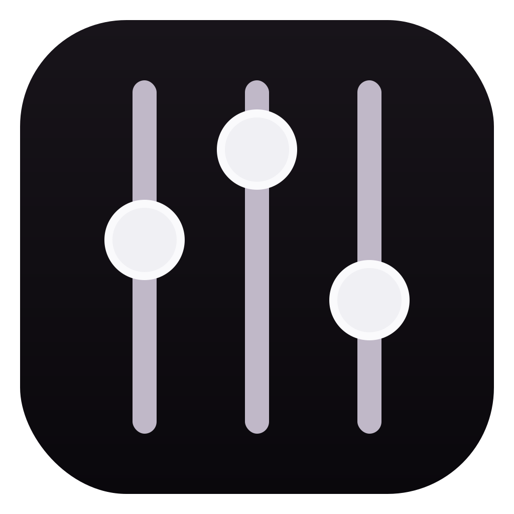
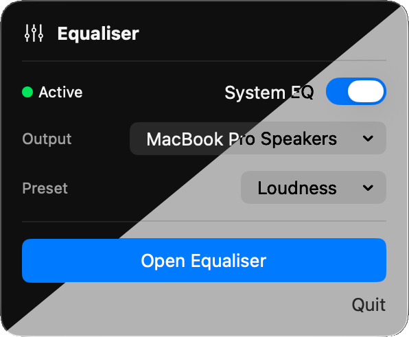
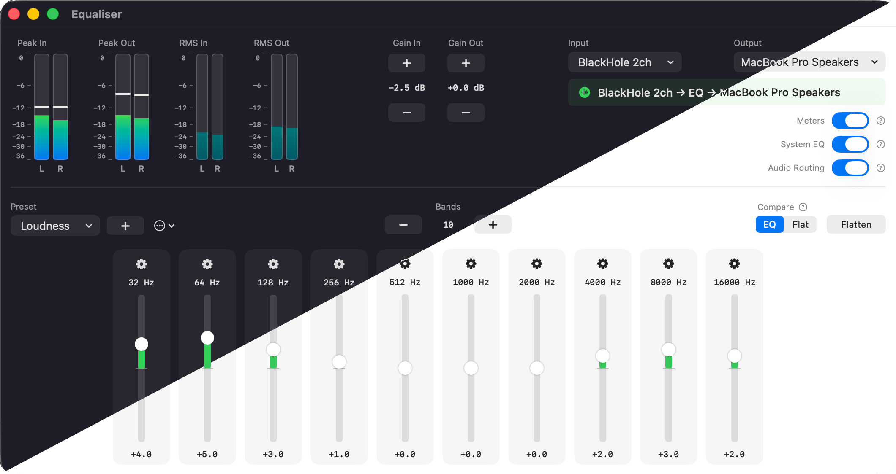

#  Equaliser

**Equaliser** (🇬🇧) is a system-wide audio equalizer (🇺🇸) for macOS.

It lets you shape the sound of everything playing on your Mac — Spotify, YouTube, films, games, or any other app.

Equaliser runs quietly in your **menu bar**, keeping your Dock uncluttered.


## Menu Bar Control

Equaliser lives in the macOS menu bar, where you can quickly enable or disable system EQ, select output device, and access presets.

<p align="center">
  
</p>


## Equaliser Interface

Equaliser provides a parametric equaliser with up to **64 adjustable bands**.  
Each band allows precise control over **frequency**, **gain**, and **bandwidth**, making it possible to subtly correct headphones or completely reshape your sound.

<p align="center">
  
</p>

Level meters allow you to monitor both **input and output signals** in real time, with clip indicators to help you detect and avoid distortion. **Compare Mode** lets you instantly switch between your EQ curve and a flat response at matched volume.

All settings — including device routing, EQ state, and presets — are remembered automatically between launches.


## Features

- **Up to 64 bands of parametric EQ** — precise frequency, gain, and bandwidth control.  
- **Compare Mode** — quickly A/B your EQ curve against a flat response.  
- **Real-time level meters with clip indicators** — monitor input/output and avoid distortion.  
- **Presets** — built-in options like Bass Boost and Vocal Presence; save your own.  
- **EasyEffects import/export** — share presets with Linux users.  
- **System EQ toggle** — bypass all processing instantly.  
- **Persistent settings** — device routing, EQ state, and preferences are remembered.


## How It Works

Equaliser uses **BlackHole**, a free virtual audio driver, to capture and process system audio.

Your Mac sends audio to BlackHole, Equaliser applies the EQ, and the processed signal is then sent to your speakers or headphones.

```
Apps → BlackHole → Equaliser → Speakers / Headphones
```


## Getting Started

### Install BlackHole

Download the free **2-channel version**:

https://existential.audio/blackhole/

Or install with Homebrew:

```bash
brew install blackhole-2ch
```

### Get Equaliser

Download the latest version from **Releases**, or build from source:

```bash
swift build -c release
./bundle.sh
```

### Set Up Audio Routing

1. Open **System Settings → Sound**
2. Set the system output to **BlackHole 2ch**
3. Open **Equaliser** from the menu bar
4. Select:
   * **Input:** BlackHole 2ch
   * **Output:** your speakers or headphones
5. Click **Start**

Audio from all applications will now pass through Equaliser.

## Requirements

* macOS 15 (Sequoia) or later
* Apple Silicon Mac
* BlackHole 2ch

## Permissions

Equaliser requires **Microphone access** on macOS.

This is necessary because macOS treats virtual audio devices (such as **BlackHole**) as microphone inputs.  
Granting this permission allows Equaliser to receive system audio from BlackHole so it can apply the equaliser.

Equaliser **does not record, store, or transmit microphone audio** — the permission is only used to process system sound locally.

## Alternatives

Some other macOS system audio tools you might consider:

* **[SoundMax](https://snap-sites.github.io/SoundMax/)** — Free, Open Source
* **[eqMac (older version without Pro Features)](https://github.com/bitgapp/eqMac)** — Free, Open Source
* **[Vizzdom Analyzer with EQ](https://www.krisdigital.com/en/blog/2018/08/23/vizzdom-mac-system-audio-spectrum-level-analyzer/)** — Gratis, Proprietary
* **[Hosting AU](https://ju-x.com/hostingau.html)** — Gratis, Proprietary
* **[AU Lab](https://www.apple.com/apple-music/apple-digital-masters/)** — Gratis, Proprietary
* **[eqMac (latest version)](https://eqmac.app/)** — Paid, Proprietary
* **[Sound Control 3](https://staticz.com/soundcontrol/)** — Paid, Proprietary
* **[Airfoil](https://rogueamoeba.com/airfoil/)** — Paid, Proprietary
* **[SoundSource](https://rogueamoeba.com/soundsource/)** — Paid, Proprietary

**Legend:**  
**Free** [as in Freedom](https://www.gnu.org/philosophy/free-sw.html) = FOSS; you can run, study, modify, and redistribute it  
**Gratis** = free-of-charge, but without user freedoms; source is closed  
**Paid** = software that requires purchase, regardless of license  
**Proprietary** = source is closed; you cannot modify or redistribute it  

---

Made with 🤖 in 🇩🇰
