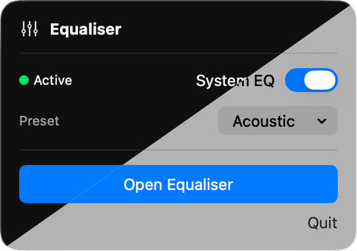

#  Equaliser

**Equaliser** (🇬🇧) is a system-wide audio equalizer (🇺🇸) for macOS.

It lets you shape the sound of everything playing on your Mac — Spotify, YouTube, films, games, or any other app.

Equaliser runs quietly in your **menu bar**, keeping your Dock uncluttered.


## Menu Bar Control

Equaliser lives in the macOS menu bar, where you can quickly enable or disable system EQ, and access presets.

<p align="center">
  
</p>


## Equaliser Interface

Equaliser provides a parametric equaliser with up to **64 adjustable bands**.  
Each band allows precise control over **frequency**, **gain**, and **bandwidth**, making it possible to subtly correct headphones or completely reshape your sound.

<p align="center">
  
</p>

Level meters allow you to monitor both **input and output signals** in real time, with clip indicators to help you detect and avoid distortion. 
**Compare Mode** lets you instantly switch between your EQ curve and a flat response at matched volume.


## Features

- **Up to 64 bands of parametric EQ** — precise frequency, gain, and bandwidth control.  
- **System EQ toggle** — bypass EQ processing instantly.  
- **Compare Mode** — quickly A/B your EQ curve against a flat response.  
- **Presets** — 11 carefully crafted presets for music, movies, and more.  
- **Native light and dark mode** — adapts automatically to your macOS system appearance.  
- **Real-time level meters** — monitor input/output and avoid distortion.  
- **Automatic Audio Routing** — automatically captures macOS selected output device.  
- **EasyEffects import/export** — share presets with Linux users.


## How It Works

Equaliser includes a **custom audio driver** that captures system audio and routes it through the Equaliser app for processing.

Your Mac sends audio through the Equaliser driver to the Equaliser app, where the EQ is applied, and the processed signal is sent to your speakers or headphones.

```
Apps → Equaliser Driver → Equaliser App (EQ) → Speakers / Headphones
```


## Getting Started

### Get Equaliser

Download the latest version from [**Releases**](https://github.com/cvknage/equaliser/releases), or build from source:

```bash
nix develop
./bundle.sh
```

### First Launch

1. Open Equaliser from your menu bar
2. If prompted, install the audio driver
3. Grant microphone permission when requested

Equaliser handles all audio routing automatically — no configuration needed.

## Uninstall

To remove Equaliser from your Mac:

1. **Uninstall the driver** — Open **Settings** (gear icon - top right) and click **Uninstall Driver**
2. **Quit the app** — Click the menu bar icon and choose **Quit**
3. **Delete the app** — Drag Equaliser from your Applications folder to the Trash

**Optional cleanup:**

Equaliser stores data in your user Library:

- Presets: `~/Library/Application Support/Equaliser/`
- Settings: `~/Library/Preferences/net.knage.equaliser.plist`

These files are small and harmless — remove them if you do not plan to reinstall Equaliser.


## Requirements

* macOS 15 (Sequoia) or later
* Apple Silicon Mac

## Privacy & Permissions

Equaliser requires **Microphone access** on macOS.

This is necessary because macOS treats the virtual audio driver as a microphone input. Granting this permission allows Equaliser to receive system audio so it can apply the equaliser.

All audio processing happens **locally on your Mac**.

Equaliser:
- does **not record audio**
- does **not store audio**
- does **not transmit audio**
- does **not include analytics or telemetry**

## Alternatives

Some other macOS system audio tools you might consider:

* **[SoundMax](https://snap-sites.github.io/SoundMax/)** — Free, Open Source, Gratis
* **[eqMac (older version without Pro Features)](https://github.com/bitgapp/eqMac)** — Free, Open Source, Gratis
* **[Vizzdom Analyzer with EQ](https://www.krisdigital.com/en/blog/2018/08/23/vizzdom-mac-system-audio-spectrum-level-analyzer/)** — Proprietary, Gratis
* **[Hosting AU](https://ju-x.com/hostingau.html)** — Proprietary, Gratis
* **[AU Lab](https://www.apple.com/apple-music/apple-digital-masters/)** — Proprietary, Gratis
* **[eqMac (latest version)](https://eqmac.app/)** — Proprietary, Paid
* **[Sound Control 3](https://staticz.com/soundcontrol/)** — Proprietary, Paid
* **[SoundSource](https://rogueamoeba.com/soundsource/)** — Proprietary, Paid

**Legend:**  
**Free** [as in Freedom](https://www.gnu.org/philosophy/free-sw.html) = FOSS; you can run, study, modify, and redistribute it  
**Gratis** = software is free-of-charge, regardless of license  
**Open Source** = source code is available for review and modification  
**Paid** = software that requires purchase, regardless of license  
**Proprietary** = source is closed; you cannot modify or redistribute it  

---

Made with 🤖 in 🇩🇰
